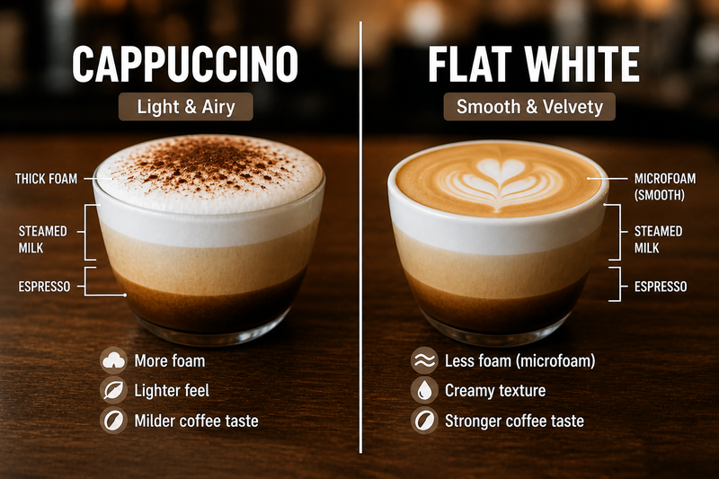

# Introduction

This notebook explores how Large Language Models can enhance recommendation systems:

- **Cold-Start Problem**: Recommend new items without interaction data
- **Zero-Shot Recommendation**: Use LLM knowledge to suggest items
- **Metadata Generation**: Enrich item catalogs with LLM-generated descriptions
- **Semantic Search**: Embed items and queries in shared space

**Key Papers:**

- @geng2022recommendation introduced P5, treating recommendation as language processing
- @zhang2023collaborative developed collaborative approaches for LLM-based recommendation
- @hou2023large demonstrated LLMs as zero-shot rankers for recommender systems

```{python}
#| label: imports

import itertools
import json
import os

import numpy as np
import polars as pl
from IPython.display import Markdown, display
from plotnine import *
from sklearn.metrics.pairwise import cosine_similarity

from recsys_genai.data_utils import load_movielens
from recsys_genai.llm_utils import (
    check_ollama_available,
    ollama_embed,
    ollama_generate,
    ollama_generate_json,
    retry,
)
from recsys_genai.notebook_utils import (
    ollama_model_link,
    show_prompt,
    show_response,
    tmdb_images,
)
```

```{python}
#| label: setup

theme_set(
    theme_minimal()
    + theme(
        plot_title=element_text(weight="bold", size=14),
        axis_title=element_text(size=12),
        figure_size=(8, 6),
    )
)

pl.Config(
    fmt_str_lengths=50,
    tbl_rows=20,
)

LLM_MODEL = os.getenv("LLM_MODEL", "ministral-3:3b")
EMBED_MODEL = os.getenv("EMBED_MODEL", "nomic-embed-text-v2-moe")

display(
    Markdown(
        f"""
**Selected models:**

- Generative: {ollama_model_link(LLM_MODEL)}
- Embedding: {ollama_model_link(EMBED_MODEL)}
"""
    )
)
```

```{python}
#| label: load-data

movies, ratings, tags, links = load_movielens("../data")
```

# The Cold-Start Problem

**Challenge**: How do we recommend a **brand new movie** that no one has rated yet?

Traditional CF methods fail: no interactions → no embeddings!

## Example: New Movie Arrives

```{python}
#| label: cold-start-example
# Simulate a new movie with only metadata
new_movie = {
    "movie_id": 999999,
    "title": "Elemental (2023)",
    "genres": ["Animation", "Comedy", "Fantasy"],
    "description": (
        "In a city where fire, water, land and air residents live together, "
        "a fiery young woman and a go-with-the-flow guy discover something "
        "elemental: how much they actually have in common."
    ),
}

display(Markdown("**New Movie:**"))
for k, v in new_movie.items():
    display(Markdown(f"- **{k}**: {v}"))
```

**Question**: Who should we recommend this to?

**Traditional answer**: Wait for users to rate it → cold start lag!

**LLM answer**: Use semantic understanding of genres and description!

# Zero-Shot Recommendation with LLMs

## Approach 1: Prompt-Based Ranking

We can ask an LLM to rank items based on user preferences!

```{python}
#| label: prompt-based-ranking
# Create the ranking prompt
ranking_prompt = """You are a movie recommendation expert.

User Profile:
- Loved: Toy Story, Finding Nemo, Up, Inside Out
- Preferred genres: Animation, Family, Comedy

New Movies to Consider:
- The Drama (2026) - Romance
- War Machine (2026) - Action, Sci-fi
- Ice Age: Boiling Point (2026) - Animation, Adventure, Comedy

Task: Rank these movies for this user (1 = best match).

Output format:
1. [Movie Title] - [Reason]
2. [Movie Title] - [Reason]
3. [Movie Title] - [Reason]
"""

display(show_prompt(ranking_prompt))

# Call the LLM
llm_ranking_response = ollama_generate(
    ranking_prompt,
    model=LLM_MODEL,
)
display(Markdown("**LLM Ranking Response:**"))
show_response(llm_ranking_response)
```

```{python}
#| label: prompt-based-ranking-json

# Create the ranking prompt
ranking_prompt = """You are a movie recommendation expert.

User Profile:
- Loved: Toy Story, Finding Nemo, Up, Inside Out
- Preferred genres: Animation, Family, Comedy

New Movies to Consider:
- The Drama (2026) - Romance
- War Machine (2026) - Action, Sci-fi
- Ice Age: Boiling Point (2026) - Animation, Adventure, Comedy

Task: Rank these movies for this user (1 = best match).

Output format:
[
    {"rank": 1, "title": "[Movie Title]", "reason": "[Reason]"},
    {"rank": 2, "title": "[Movie Title]", "reason": "[Reason]"},
    {"rank": 3, "title": "[Movie Title]", "reason": "[Reason]"}
]
"""

display(show_prompt(ranking_prompt))

# Call the LLM
llm_ranking_response = ollama_generate_json(
    ranking_prompt,
    model=LLM_MODEL,
)
show_response(llm_ranking_response)
```

**Key Insight**: LLM leverages **semantic understanding** of genres, themes, and patterns!

## Approach 2: Embedding-Based Similarity

Modern LLMs can embed text into dense vectors. We can:

1. Embed movie descriptions with LLM
2. Embed user preference descriptions
3. Compute cosine similarity

### LLM Embeddings with Ollama

```{python}
#| label: embedding-similarity

# Select favorite movies
alice_id = 1
alice_favorites = (
    ratings.filter(pl.col("user_id") == alice_id)
    .top_k(10, by="rating")
    .join(movies, on="movie_id")
    .select("movie_id", "title", "genres")
)

alice_favorites
```

```{python}
#| label: display-alice-posters

# Load posters
posters = pl.read_parquet("../data/shared/posters.parquet")

# Get poster paths for Alice's favorites (join via links to get tmdb_id)
alice_with_posters = alice_favorites.join(
    links.select(["movie_id", "tmdb_id"]), on="movie_id"
).join(posters, on="tmdb_id", how="inner")
poster_paths = alice_with_posters["poster_path"].to_list()

display(Markdown(f"**Alice's Favorite Movies**:"))
tmdb_images(poster_paths)
```

```{python}
#| label: build-user-profile

# Build text representations
movie_texts = movies.with_columns(
    text=pl.format("{}: {}", "title", pl.col("genres").list.join(", "))
)

# User profile: concatenate favorite movie texts
alice_fav_ids = ratings.filter((pl.col("user_id") == alice_id) & (pl.col("rating") >= 4.5))[
    "movie_id"
].to_list()

alice_profile_texts = movie_texts.join(alice_favorites, on="movie_id", how="semi")["text"].to_list()

alice_profile = "\n".join(alice_profile_texts)  # Use first 5 to keep it concise
display(Markdown(f"**Alice's Profile:**\n\n{alice_profile}"))
```

```{python}
#| label: select-most-rated-movies

# Get list of most rated movies
# This ensures that the demo has familiar movies
most_rated_movies = ratings.group_by("movie_id").len("num_ratings").top_k(500, by="num_ratings")
```

```{python}
#| label: embed-candidates

# Exclude movies Alice has already rated
candidate_sample = movie_texts.join(most_rated_movies, on="movie_id", how="semi").join(
    alice_favorites, on="movie_id", how="anti"
)
candidate_texts = candidate_sample["text"].to_list()
candidate_ids = candidate_sample["movie_id"].to_list()

# Embed user profile
user_embedding = ollama_embed(alice_profile, model=EMBED_MODEL)

# Embed movies in batches for efficiency
batch_size = 50
movie_embeddings = []

for batch in itertools.batched(candidate_texts, batch_size):
    batch_embeddings = ollama_embed(batch, model=EMBED_MODEL)
    movie_embeddings.extend(batch_embeddings)
```

```{python}
#| label: compute-embedding-similarities

# Convert to numpy arrays
user_vec = np.array(user_embedding).reshape(1, -1)
item_vecs = np.array(movie_embeddings)

# Compute similarities
similarities = cosine_similarity(user_vec, item_vecs)[0]

# TODO(augment): display shapes as human readable (use markdown)
user_vec.shape, item_vecs.shape, similarities.shape
```

```{python}
#| label: display-embedding-recommendations

# Top-10 recommendations
display(Markdown("**LLM Embedding-Based Recommendations:**"))
top_movies_llm = (
    pl.DataFrame({"movie_id": candidate_ids, "similarity": similarities})
    .join(movies, on="movie_id")
    .top_k(10, by="similarity")
)

top_movies_llm
```

```{python}
#| label: display-embedding-rec-posters

# Display posters for recommendations (join via links to get tmdb_id)
rec_with_posters = top_movies_llm.join(links.select(["movie_id", "tmdb_id"]), on="movie_id").join(
    posters, on="tmdb_id", how="inner"
)
rec_poster_paths = rec_with_posters["poster_path"].to_list()

display(Markdown(f"**Recommended for Alice**"))
tmdb_images(rec_poster_paths)
```

**Note**: LLM embeddings capture semantic relationships between movies and user preferences!

# Metadata Generation

LLMs can enrich sparse movie catalogs by generating:

- **Tags/Keywords**: "heartwarming", "visually stunning"
- **Mood Labels**: "uplifting", "intense", "nostalgic"
- **Thematic Topics**: "coming-of-age", "family bonds", "adventure"

## Example Prompt for Metadata Generation

```{python}
#| label: metadata-generation
example_movie = movies.filter(pl.col("title").str.contains("Gump")).to_dicts()[0]
metadata_prompt = f"""\
You are a film analyst. Generate metadata for this movie:

Title: {example_movie["title"]}
Genres: {", ".join(example_movie["genres"])}

Generate:
1. Three thematic tags (e.g., friendship, adventure)
2. Mood label (one word)
3. Target audience (one phrase)
4. Similar movie archetypes

Output ONLY valid JSON in this format:
{{
  "thematic_tags": ["tag1", "tag2", "tag3"],
  "mood": "word",
  "target_audience": "phrase",
  "similar_archetypes": ["archetype1", "archetype2"]
}}
"""

display(show_prompt(metadata_prompt))

# Generate metadata using LLM
generated_metadata = ollama_generate_json(
    metadata_prompt,
    model=LLM_MODEL,
    temperature=0.3,  # Lower temperature for more structured output
)

display(show_response(generated_metadata))
```

**Use Cases:**

1. **Enhanced Search**: Users can query "heartwarming family movies"
2. **Mood-Based Recommendation**: Filter by emotional tone
3. **Richer Embeddings**: Incorporate generated tags into item representations

## Batch Metadata Generation

In production, you'd generate metadata for entire catalog. Let's use **multiple descriptive dimensions** to create rich movie profiles.

### Define Descriptive Dimensions

We'll generate three types of descriptions for each movie:

1. **Mood and Atmosphere**: Emotional tone and viewing experience (e.g., "uplifting", "tense", "melancholic")
2. **Target Audience**: Who would enjoy this movie and why (e.g., "families with young children", "thriller enthusiasts")
3. **Plot Essence**: Core narrative elements in 1-2 sentences (e.g., "A toy's journey to find its owner")

```{python}
#| label: batch-metadata-sample-movies

# Sample from most-rated movies
sample_movies = movies.join(most_rated_movies, on="movie_id", how="semi").sample(n=30, seed=42)

display(
    Markdown(f"**Sampled {len(sample_movies)} movies** from most-rated for metadata generation")
)
display(Markdown("**Sample titles:**"))
sample_movies.select("title")
```

```{python}
#| label: metadata-generation-function

# Retrying multiple times in case of invalid response
# Small LLMs sometimes fail to follow instruction about structure


@retry(3, exceptions=(ValueError, json.JSONDecodeError))
def generate_movie_metadata(title, genres):
    """Generate multi-dimensional metadata using LLM.

    Returns:
        dict with keys: mood, target_audience, plot_essence
    """
    prompt = f"""You are a film critic. Describe this movie along three dimensions:

Title: {title}
Genres: {", ".join(genres) if genres else "Unknown"}

Generate brief descriptions (up to 2 sentences each):

1. Mood and Atmosphere: What's the emotional tone? How does it feel to watch?
2. Target Audience: Who would enjoy this and why?
3. Plot Essence: Core story in 1-2 sentences.

Output ONLY valid JSON:
{{
  "mood": "brief description",
  "target_audience": "brief description",
  "plot_essence": "brief description"
}}
"""
    metadata = ollama_generate_json(prompt, model=LLM_MODEL, temperature=0.3)
    required_keys = {"mood", "target_audience", "plot_essence"}
    if not required_keys.issubset(metadata):
        raise ValueError(f"One or more keys are missing: {required_keys - set(metadata)}")
    return metadata
```

```{python}
#| label: metadata-generation-axes

# Generate metadata for all sampled movies
llm_metadata = []
print("Generating multi-dimensional metadata...")

for i, movie in enumerate(sample_movies.to_dicts()):
    print(f"  [{i + 1}/{len(sample_movies)}] {movie['title']}")
    metadata = generate_movie_metadata(movie["title"], movie["genres"])
    llm_metadata.append(metadata)

llm_metadata_df = pl.DataFrame(llm_metadata)
print("\n✅ Metadata generation complete!")
```

```{python}
#| label: display-generated-metadata

show_response(llm_metadata[:3])
```

```{python}
#| label: enrich-movies-df

enriched_df = pl.concat([sample_movies, llm_metadata_df], how="horizontal")
```

```{python}
#| label: display-enriched-catalog

# Display first movie with full metadata
first_movie = enriched_df.to_dicts()[0]

display(
    Markdown(f"""
**Example: {first_movie["title"]}**

**Genres:** {", ".join(first_movie["genres"])}

**Mood:** {first_movie["mood"]}

**Target Audience:** {first_movie["target_audience"]}

**Plot Essence:** {first_movie["plot_essence"]}
""")
)
```

### Embed Each Dimension

Now let's embed each metadata dimension separately. This allows us to find similar movies along each axis:

```{python}
#| label: embed-dimensions

# Extract text for each dimension
mood_texts = enriched_df["mood"].to_list()
audience_texts = enriched_df["target_audience"].to_list()
plot_texts = enriched_df["plot_essence"].to_list()

print("Generating embeddings for each dimension...")
print(f"  - Mood: {len(mood_texts)} descriptions")
print(f"  - Target Audience: {len(audience_texts)} descriptions")
print(f"  - Plot Essence: {len(plot_texts)} descriptions")
```

```{python}
#| label: generate-dimension-embeddings

# Generate embeddings for each dimension (in batches)
print("\nEmbedding mood descriptions...")
mood_embeddings = []
for batch in itertools.batched(mood_texts, 10):
    batch_emb = ollama_embed(list(batch), model=EMBED_MODEL)
    mood_embeddings.extend(batch_emb)

print("Embedding target audience descriptions...")
audience_embeddings = []
for batch in itertools.batched(audience_texts, 10):
    batch_emb = ollama_embed(list(batch), model=EMBED_MODEL)
    audience_embeddings.extend(batch_emb)

print("Embedding plot essence descriptions...")
plot_embeddings = []
for batch in itertools.batched(plot_texts, 10):
    batch_emb = ollama_embed(list(batch), model=EMBED_MODEL)
    plot_embeddings.extend(batch_emb)

# Convert to numpy arrays (one row per movie)
mood_matrix = np.array(mood_embeddings)
audience_matrix = np.array(audience_embeddings)
plot_matrix = np.array(plot_embeddings)

print(f"\n✅ Embedding complete!")
print(f"  - Mood matrix shape: {mood_matrix.shape}")
print(f"  - Audience matrix shape: {audience_matrix.shape}")
print(f"  - Plot matrix shape: {plot_matrix.shape}")
```

### Sort by Semantic Similarity

Now we can find movies similar to the first movie along each dimension using cosine similarity:

```{python}
#| label: compute-similarities-per-dimension

# Reference movie (first item)
reference_idx = 0
reference_movie = enriched_df.to_dicts()[reference_idx]

display(Markdown(f"**Reference Movie:** {reference_movie['title']}"))
display(Markdown(f"**Genres:** {', '.join(reference_movie['genres'])}"))

# Compute cosine similarity for each dimension
# Mood similarities
mood_ref = mood_matrix[reference_idx].reshape(1, -1)
mood_similarities = cosine_similarity(mood_ref, mood_matrix)[0]

# Audience similarities
audience_ref = audience_matrix[reference_idx].reshape(1, -1)
audience_similarities = cosine_similarity(audience_ref, audience_matrix)[0]

# Plot similarities
plot_ref = plot_matrix[reference_idx].reshape(1, -1)
plot_similarities = cosine_similarity(plot_ref, plot_matrix)[0]
```

```{python}
#| label: create-similarity-dataframes

# Create dataframe with similarities for each dimension
similarity_df = enriched_df.select(
    ["movie_id", "title", "mood", "target_audience", "plot_essence"]
).with_columns(
    [
        pl.Series("mood_similarity", mood_similarities),
        pl.Series("audience_similarity", audience_similarities),
        pl.Series("plot_similarity", plot_similarities),
    ]
)

# Exclude the reference movie itself (similarity = 1.0)
other_movies_df = similarity_df.filter(pl.col("title") != reference_movie["title"])

print(f"✅ Computed similarities for {len(other_movies_df)} movies")
```

```{python}
#| label: display-similarity-sample

other_movies_df.select(
    ["title", "mood_similarity", "audience_similarity", "plot_similarity"]
).head()
```

```{python}
#| label: sort-by-mood-similarity

display(Markdown("### Most Similar by Mood\n"))

sorted_by_mood = other_movies_df.sort("mood_similarity", descending=True)
for movie in sorted_by_mood.select(["title", "mood", "mood_similarity"]).head(5).to_dicts():
    display(
        Markdown(
            f"**• {movie['title']}** (similarity: {movie['mood_similarity']:.3f})  \n  *Mood: {movie['mood']}*\n"
        )
    )
```

```{python}
#| label: sort-by-audience-similarity

display(Markdown("### Most Similar by Target Audience\n"))

sorted_by_audience = other_movies_df.sort("audience_similarity", descending=True)
for movie in (
    sorted_by_audience.select(["title", "target_audience", "audience_similarity"])
    .head(5)
    .to_dicts()
):
    display(
        Markdown(
            f"**• {movie['title']}** (similarity: {movie['audience_similarity']:.3f})  \n  *Audience: {movie['target_audience']}*\n"
        )
    )
```

```{python}
#| label: sort-by-plot-similarity

display(Markdown("### Most Similar by Plot Essence\n"))

sorted_by_plot = other_movies_df.sort("plot_similarity", descending=True)
for movie in sorted_by_plot.select(["title", "plot_essence", "plot_similarity"]).head(5).to_dicts():
    display(
        Markdown(
            f"**• {movie['title']}** (similarity: {movie['plot_similarity']:.3f})  \n  *Plot: {movie['plot_essence']}*\n"
        )
    )
```

**Key Insights**:

- **Multi-dimensional similarity**: Same movie can be similar to different movies along different axes
- **Semantic understanding**: LLM embeddings capture meaning, not just keyword matching
- **Flexible discovery**: Users can find movies by mood, audience fit, or plot similarity

This enables:
- **Mood-based browsing**: "Show me movies with a similar atmosphere"
- **Audience-targeted recommendations**: "Find movies for the same demographic"
- **Plot-based discovery**: "Movies with similar narrative structures"

### Visual Comparison: Three Dimensions of Similarity

```{python}
#| label: display-dimension-comparison-posters

# Get top 5 movies for each dimension
mood_top5 = sorted_by_mood.head(5)
audience_top5 = sorted_by_audience.head(5)
plot_top5 = sorted_by_plot.head(5)

# Join with posters (via links to get tmdb_id)
links_tmdb = links.select(["movie_id", "tmdb_id"])
mood_posters = mood_top5.join(links_tmdb, on="movie_id").join(
    posters, on="tmdb_id", how="inner", maintain_order="left"
)
audience_posters = audience_top5.join(links_tmdb, on="movie_id").join(
    posters, on="tmdb_id", how="inner", maintain_order="left"
)
plot_posters = plot_top5.join(links_tmdb, on="movie_id").join(
    posters, on="tmdb_id", how="inner", maintain_order="left"
)

# Display each dimension
display(Markdown(f"**Reference:** {reference_movie['title']}\n"))

display(Markdown("**Most Similar by MOOD:**"))
display(tmdb_images(mood_posters["poster_path"].to_list()))

display(Markdown("***\n**Most Similar by TARGET AUDIENCE:**"))
display(tmdb_images(audience_posters["poster_path"].to_list()))

display(Markdown("***\n**Most Similar by PLOT ESSENCE:**"))
display(tmdb_images(plot_posters["poster_path"].to_list()))
```

Notice how the same reference movie yields **different recommendations** depending on which dimension we prioritize!

# True Cold Start: Unknown Content

## The Cold Start Spectrum

So far, we've been handling **"cold for our system"** items:

- Movies like "Toy Story", "The Matrix" are well-known to LLMs
- LLMs have extensive training data about these items
- We can leverage their world knowledge

**True cold start** = Content completely unknown to the LLM:

- Brand new videos, podcasts, articles
- User-generated content (social media)
- Internal company content
- Truly novel items

## Example: Short-Form Video

Let's demonstrate with a short video that didn't exist during LLM training. We have:

- **Transcript**: What's said in the video
- **Screenshots**: Visual frames from the video

```{python}
#| label: load-video-data

# Load transcript
with open("../data/shared/short_form/transcript.txt", "r") as f:
    video_transcript = f.read()

display(Markdown(f"**Video Transcript:**\n\n```\n{video_transcript}\n```"))
```

::: {layout-ncol=4}




:::

## Generate Video Description

First, ask the LLM to create a coherent description from the raw transcript:

```{python}
#| label: generate-video-description

description_prompt = f"""You are a content analyst. Below is a transcript from a short-form video.

Create a concise, engaging description of this video (2-3 sentences) that captures:
- The main topic/theme
- The format/style
- The key takeaway

Transcript:
{video_transcript}

Output ONLY the description text (no extra formatting):
"""

video_description = ollama_generate(description_prompt, model=LLM_MODEL, temperature=0.3)

display(Markdown(f"**Generated Video Description:**\n\n{video_description}"))
```

## Generate Metadata for Unknown Content

Now generate rich metadata from the description:

```{python}
#| label: generate-video-metadata

metadata_prompt = f"""You are a content analyst. Generate metadata for this video.

Video Description:
{video_description}

Original Transcript (for context):
{video_transcript[:500]}...

Generate metadata along the same dimensions as before:

Output ONLY valid JSON:
{{
  "mood": "brief description of emotional tone",
  "target_audience": "who would enjoy this and why",
  "plot_essence": "core narrative/content in 1-2 sentences",
  "tags": ["tag1", "tag2", "tag3", "tag4", "tag5"]
}}
"""

video_metadata = ollama_generate_json(metadata_prompt, model=LLM_MODEL, temperature=0.3)

display(Markdown("**Generated Metadata:**"))
show_response(video_metadata)
```

## Find Similar Movies

Now we can find movies similar to this completely new content:

```{python}
#| label: embed-video-description

# Embed the video description
video_embedding = ollama_embed(video_description, model=EMBED_MODEL)
video_vec = np.array(video_embedding).reshape(1, -1)

# Compare to movie plot embeddings from earlier
video_plot_similarities = cosine_similarity(video_vec, plot_matrix)[0]

# Create results dataframe
video_similarity_df = enriched_df.select(["title", "plot_essence"]).with_columns(
    [pl.Series("similarity", video_plot_similarities)]
)

display(
    Markdown(
        f"Comparing video to **{len(video_similarity_df)} movies**...\n\n### Top 5 Most Similar Movies by Content\n"
    )
)

top_similar = video_similarity_df.sort("similarity", descending=True).head(5)
for movie in top_similar.to_dicts():
    display(
        Markdown(
            f"**• {movie['title']}** (similarity: {movie['similarity']:.3f})  \n  *Plot: {movie['plot_essence']}*\n"
        )
    )
```

**Key Insight**:

- We started with completely unknown content (transcript + screenshots)
- LLM generated description and metadata **on-the-fly**
- We can now recommend this new content to users with similar preferences
- This works for **any** new content type: videos, articles, podcasts, products

**True cold start solved** using LLM's ability to understand and generate metadata from raw content!


# Key Takeaways

- **Zero-Shot Recommendation**: LLMs can recommend without training data by leveraging semantic understanding
- **Cold-Start Problem Solved**: Generate metadata for completely unknown content (videos, podcasts, articles)
- **Metadata Enrichment**: LLMs generate rich descriptions across multiple dimensions (mood, audience, plot)
- **Multi-Dimensional Similarity**: Different aspects (mood, audience, plot) yield different recommendations
- **Semantic Embeddings**: Capture nuanced relationships beyond keyword matching

**Important Papers:**

- **P5**: Treats recommendation as sequence-to-sequence task [@geng2022recommendation]
- **LLMRec**: Uses LLM as ranker for candidate items [@hou2023large]

**Next**: Part IV.a - Conversational Recommendation with Keyphrases!
